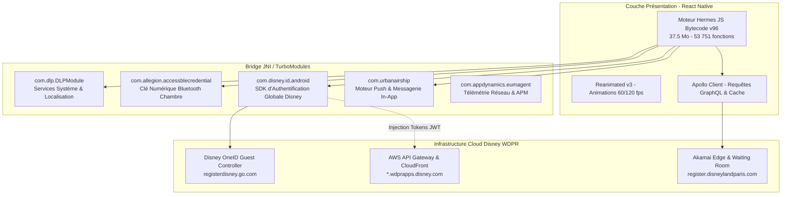
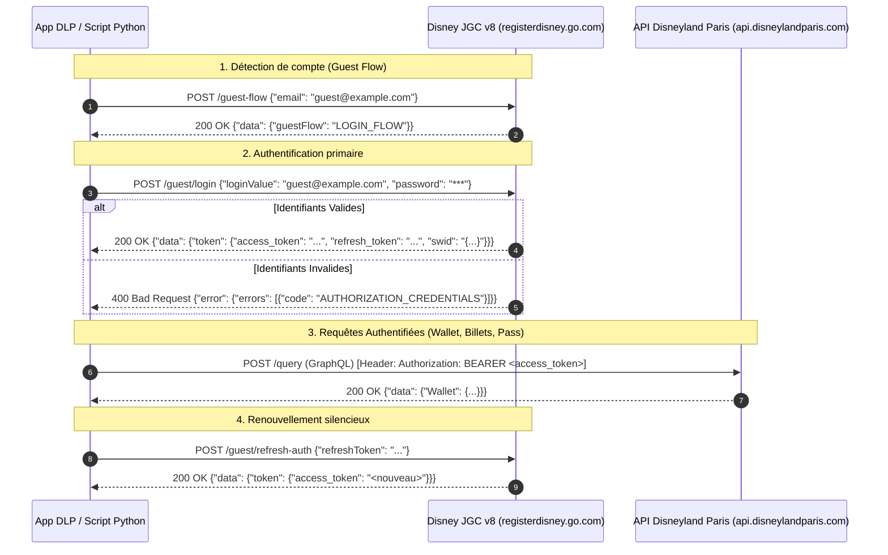

# 🏰 Disneyland Paris - Spécification Complète de l'Application & Guide des APIs Officielles

> **Version de l'application analysée** : `7.16.0` (Build `7507`, Build Label `KINNEY`, App ID `fr.disneylandparis.android`)  
> **Type d'architecture** : React Native (Hermes Bytecode v96) + SDKs Natifs Android (Kotlin / Java)  
> **Cible de ce document** : Développeurs & Agents IA souhaitant comprendre l'architecture interne complète de l'application Disneyland Paris et intégrer directement ses API officielles (WaitTimes, Schedules, GraphQL, OneID) de manière robuste.

---

## Table des Matières
1. [Architecture Interne de l'Application Mobile](#1-architecture-interne-de-lapplication-mobile)
2. [Cartographie Complète des APIs & Endpoints Officiels](#2-cartographie-complète-des-apis--endpoints-officiels)
   - [2.1 API WaitTimes : Temps d'Attente Temps Réel](#21-api-waittimes--temps-dattente-temps-réel)
   - [2.2 API Schedules & Entités : Requêtes GraphQL Officielles](#22-api-schedules--entités--requêtes-graphql-officielles)
   - [2.3 API Disney OneID : Authentification & Guest Controller](#23-api-disney-oneid--authentification--guest-controller)
   - [2.4 Services Billetterie, MagicMobile & Premier Access](#24-services-billetterie-magicmobile--premier-access)
   - [2.5 Services Hôteliers & Clé de Chambre Bluetooth (Allegion BLE)](#25-services-hôteliers--clé-de-chambre-bluetooth-allegion-ble)
3. [Analyse de Sécurité : Passerelle AWS, Akamai & Diagnostic du 403](#3-analyse-de-sécurité--passerelle-aws-akamai--diagnostic-du-403)
4. [Méthodologie d'Accès Direct Officiel (Interception & Rejeu)](#4-méthodologie-daccès-direct-officiel-interception--rejeu)
5. [Contrats de Données & Modèles de Types (TypeScript & Pydantic)](#5-contrats-de-données--modèles-de-types-typescript--pydantic)
6. [Règles d'Ingénierie pour Agents Autonomes ("Ne Rien Casser")](#6-règles-dingénierie-pour-agents-autonomes-ne-rien-casser)
7. [Client de Référence Python Asynchrone](#7-client-de-référence-python-asynchrone)
8. [Cas d'Usage Avancés & Idées de Projets](#8-cas-dusage-avancés--idées-de-projets)

---

## 1. Architecture Interne de l'Application Mobile

L'application officielle Disneyland Paris v7.16 est une application hybride de haute technicité, combinant une interface réactive multiplateforme et une couche de microservices natifs en Java/Kotlin :



### Principaux Composants Natifs Découverts dans le Code (`app/`) :
1. **`com.disney.id.android (OneID SDK)`** :
   - Le système d'authentification centralisé de The Walt Disney Company.
   - Gère le cycle de vie des sessions visiteurs (`GuestHandler`, `Token`, `Session`).
   - Implémente `AuthorizationInterceptor` qui injecte dynamiquement les jetons Bearer (`Authorization: BEARER <token>`) ou clés API (`Authorization: APIKEY <key>`).
2. **`com.allegion.accessblecredential`** :
   - Module matériel Bluetooth Low Energy (BLE).
   - Permet de transformer le smartphone en clé dématérialisée pour déverrouiller la porte des chambres des hôtels Disney (*Disneyland Hotel*, *Disney Hotel New York - The Art of Marvel*, *Newport Bay Club*, etc.).
3. **`com.urbanairship` (Airship SDK)** :
   - Moteur d'engagement temps réel gérant les notifications push géolocalisées, le déclenchement d'alertes lors de l'arrivée dans le parc et les notifications de rappel pour les files d'attente virtuelles.
4. **`com.appdynamics.eumagent.runtime`** :
   - Outil de métrique et de surveillance réseau (End User Monitoring) interceptant toutes les requêtes OkHttp pour auditer les temps de réponse et détecter les anomalies réseau.

---

## 2. Cartographie Complète des APIs & Endpoints Officiels

Toutes les données officielles proviennent de deux infrastructures distinctes : le cluster **WDPRApps** (sur AWS) et l'infrastructure **GraphQL / Web** (sur Akamai).

---

### 2.1 API WaitTimes : Temps d'Attente Temps Réel (Confirmé en Direct)

* **URL Principale (Live Production)** : `https://dlp-wt.wdprapps.disney.com/prod/v1/waitTimes`
* **Méthode** : `GET`
* **Protocole** : HTTPS / REST JSON (HTTP/2)
* **Authentification** : Clé API fixe (aucun compte utilisateur ni jeton Bearer requis pour le direct)

#### Headers Requis (Capturés & Validés)
```http
GET /prod/v1/waitTimes HTTP/2
Host: dlp-wt.wdprapps.disney.com
x-api-key: 3jPT5qMimN3kR2kxqd1ez9iF1C68CrBf7zw5ICo4
User-Agent: okhttp/4.12.0
Accept: application/json, text/plain, */*
Accept-Encoding: gzip
```

#### Schéma et Description des Champs
La réponse retourne un tableau JSON de toutes les attractions du resort :
```json
[
  {
    "id": "P1AA01",
    "name": "Big Thunder Mountain",
    "entityType": "Attraction",
    "parkId": "P1",
    "status": "OPERATING",
    "postedWaitMinutes": 45,
    "singleRider": {
      "isAvailable": true,
      "waitMinutes": 20
    },
    "standby": {
      "isAvailable": true
    },
    "virtualQueue": {
      "isAvailable": false
    },
    "premierAccess": {
      "isAvailable": true,
      "price": 16.0
    },
    "lastUpdated": "2026-09-14T14:30:00Z"
  }
]
```

* **`status`** :
  * `OPERATING` : Attraction ouverte, visiteurs acceptés, temps d'attente actif.
  * `DOWN` : Panne temporaire ou arrêt technique.
  * `CLOSED` : Fermée pour la journée ou en dehors des horaires d'exploitation (la nuit, l'API renvoie `[]`).
  * `REFURBISHMENT` : Réhabilitation programmée (travaux).
* **`postedWaitMinutes`** : Temps d'attente estimé en minutes pour la file standard.
* **`singleRider`** : Disponibilité et temps d'attente de la file pour passagers seuls.
* **`premierAccess`** : Disponibilité et tarif unitaire du coupe-file payant *Disney Premier Access One*.

---

### 2.2 API Schedules & Entités : Endpoint GraphQL Officiel (Confirmé en Direct)

Contrairement aux anciens microservices REST dépréciés (`stage.dlp-sp.wdprapps.disney.com` qui renvoie `403`), l'application mobile v7.16 utilise l'API centrale GraphQL sur **`api.disneylandparis.com`**.

* **URL Officielle (Production)** : `https://api.disneylandparis.com/query`
* **Méthode** : `POST`
* **Protocole** : HTTPS / JSON (HTTP/2)
* **Headers Requis (Testés & 100% Fonctionnels)** :
  ```http
  POST /query HTTP/2
  Host: api.disneylandparis.com
  x-application-id: mobile-app
  Content-Type: application/json
  User-Agent: okhttp/4.12.0
  Accept: application/json
  Accept-Encoding: gzip
  ```

#### Requête 1 : `query activitySchedules` (Horaires des Parcs, Spectacles, Parades et Attractions)
Cette requête unique renvoie l'ensemble des horaires d'ouverture des parcs (y compris créneaux *Extra Magic Hours*), les heures des spectacles, parades, et les fermetures exceptionnelles :

```graphql
query activitySchedules($market: String!, $types: [ActivityScheduleStatusInput]!, $date: String!) {
  activitySchedules(market: $market, date: $date, types: $types) {
    __typename
    id
    name
    type
    subType
    url
    urlFriendlyId
    hideFunctionality
    highlightTag
    containerTcmId
    heroMediaMobile { url alt }
    squareMediaMobile { url alt }
    pageLink {
      url
      regions { contentId templateId schemaId }
    }
    location { ...location }
    subLocation { ...location }
    schedules(date: $date, types: $types) {
      startTime
      endTime
      date
      status
      closed
      language
    }
  }
}

fragment location on Location {
  id
  value
  urlFriendlyId
  iconFont
  pageLink {
    url
    tcmId
    title
    regions { contentId templateId schemaId }
  }
}
```

* **Corps JSON complet (Payload de test éprouvé en Python)** :
```json
{
  "query": "query activitySchedules($market:String! $types:[ActivityScheduleStatusInput]! $date:String!){activitySchedules(market:$market,date:$date,types:$types){__typename id name subType url pageLink{url regions{contentId templateId schemaId}}heroMediaMobile{url alt}squareMediaMobile{url alt}hideFunctionality highlightTag containerTcmId urlFriendlyId location{...location}subLocation{...location}type subType schedules(date:$date,types:$types){startTime endTime date status closed language}}}fragment location on Location{id value urlFriendlyId iconFont pageLink{url tcmId title regions{contentId templateId schemaId}}}",
  "variables": {
    "market": "fr-fr",
    "types": [
      { "type": "ThemePark", "status": ["OPERATING", "EXTRA_MAGIC_HOURS"] },
      { "type": "Entertainment", "status": ["PERFORMANCE_TIME"] },
      { "type": "Attraction", "status": ["OPERATING", "REFURBISHMENT", "CLOSED"] },
      { "type": "Resort", "status": ["OPERATING", "REFURBISHMENT", "CLOSED"] },
      { "type": "Shop", "status": ["REFURBISHMENT", "CLOSED"] },
      { "type": "Restaurant", "status": ["REFURBISHMENT", "CLOSED"] },
      { "type": "DiningEvent", "status": ["REFURBISHMENT", "CLOSED"] },
      { "type": "DinnerShow", "status": ["REFURBISHMENT", "CLOSED"] }
    ],
    "date": ""
  }
}
```

* **Exemples d'éléments renvoyés (Status 200)** :
  * **Parc Disneyland / Disney Adventure World** :
    ```json
    {
      "id": "P2",
      "name": "Disney Adventure World",
      "schedules": [
        { "startTime": "09:30:00", "endTime": "21:00:00", "status": "OPERATING", "closed": false },
        { "startTime": "08:30:00", "endTime": "09:30:00", "status": "EXTRA_MAGIC_HOURS", "closed": false }
      ]
    }
    ```
  * **Spectacles & Parades** :
    ```json
    {
      "id": "P1MG86",
      "name": "Rencontre avec Minnie ou ses amies en Europe",
      "schedules": [
        { "startTime": "10:00:00", "endTime": "10:00:00", "status": "PERFORMANCE_TIME" },
        { "startTime": "10:30:00", "endTime": "10:30:00", "status": "PERFORMANCE_TIME" }
      ]
    }
    ```

#### Requête 3 : `query themeParks` (Cartographie, bornes et entrées des parcs)
```graphql
query themeParks($market: String!, $types: [String]) {
  activities(market: $market, types: $types) {
    id
    name
    contentType: __typename
    medias {
      type
      media {
        url
      }
    }
    coordinates {
      type
      lat
      lng
    }
  }
}
```
* **Variables** : `{"market": "fr-fr", "types": ["ThemePark"]}`
* **Données renvoyées** : Liste des 2 parcs (`P1`: Parc Disneyland, `P2`: Disney Adventure World) avec les coordonnées GPS exactes des entrées (`Guest Entrance`), des limites géographiques (`North East Bounds`, `South West Bounds`) et du logo.

#### Requête 4 : `query attraction` (Catalogue complet des 62 attractions)
```graphql
query attraction($market: String!, $types: [String]) {
  activities(market: $market, types: $types) {
    id
    name
    hideFunctionality
    location {
      value
    }
    subLocation {
      value
    }
    coordinates {
      lat
      lng
    }
  }
}
```
* **Variables** : `{"market": "fr-fr", "types": ["Attraction"]}`
* **Données renvoyées** : L'ensemble des 62 attractions avec leur Land (`Fantasyland`, `Discoveryland`, `Adventureland`, `Frontierland`, `World Premiere Plaza`, etc.) et coordonnées géographiques.

#### Requête 5 : `query restaurants` (Catalogue des 105 restaurants)
```graphql
query restaurants($market: String!, $types: [String]) {
  activities(market: $market, types: $types) {
    id
    name
    hideFunctionality
    location {
      value
    }
    subLocation {
      value
    }
  }
}
```
* **Variables** : `{"market": "fr-fr", "types": ["Restaurant"]}`
* **Données renvoyées** : 105 restaurants répertoriés (service à table, buffet à volonté, restauration rapide, bars des hôtels et snacks du Disney Village).

##### Disponibilités des Restaurants en Temps Réel (Sans Bearer Token) :
L'état d'ouverture et les plages horaires de service de chaque restaurant s'obtiennent directement sans aucune authentification :
```graphql
query restaurantAvailabilities($market: String!, $types: [ActivityScheduleStatusInput]!, $date: String!) {
  activitySchedules(market: $market, date: $date, types: $types) {
    id
    name
    subType
    location { value }
    subLocation { value }
    schedules(date: $date, types: $types) {
      startTime
      endTime
      date
      status
      closed
    }
  }
}
```
* **Variables** :
  ```json
  {
    "market": "fr-fr",
    "types": [{"type": "Restaurant", "status": ["OPERATING", "REFURBISHMENT", "CLOSED"]}],
    "date": ""
  }
  ```
* **Statuts Clés Renvoyés** :
  * `OPERATING` (`closed: false`) : Restaurant ouvert au service avec les heures de début et fin de service (ex: `11:30:00` - `20:00:00`).
  * `REFURBISHMENT` (`closed: true`) : Restaurant fermé pour réhabilitation/travaux saisonniers (ex: *Yacht Club*, *Plaza Gardens Restaurant*).
  * `CLOSED` : Fermé ponctuellement pour la journée.

##### Réservation de Tables (DRS - Dining Reservation Service) :
Pour vérifier la disponibilité de créneaux de table et réserver, Disneyland Paris utilise le microservice officiel AWS WDPRApps :

* **Base URL de Production** : `https://dlp-is-sales-drs-book-dine.wdprapps.disney.com/prod`
* **API Key Requise** : `AaQHDoRgDa66dl2PQuTEe9DjyBlH8ylV4LxnldFY`
* **Niveau d'Autorisation Requis** : `Authorization: Bearer <access_token>` avec portée **High-Trust** (`AUTHZ_GUEST_SECURED_SESSION`). Une session non sécurisée (`AUTHZ_GUEST_UNSECURED_SESSION`) renvoie une erreur `FORBIDDEN_SCOPE`.

###### 1. Endpoint Calendrier des Dates Disponibles (`availableDates`)
* **URL** : `GET /v4/book-dine/availableDates/{market}?restaurantId={id}&sourceSite=web&scope=Restaurant`
* **Exemple** : `GET https://dlp-is-sales-drs-book-dine.wdprapps.disney.com/prod/v4/book-dine/availableDates/fr-fr?restaurantId=P1AR00&sourceSite=web&scope=Restaurant`
* **Paramètres Query** :
  * `restaurantId` : Identifiant officiel du restaurant (ex: `P1AR00` pour *Captain Jack's*, `P2TR02` pour *Bistrot Chez Rémy*, `P1AR06` pour *Agrabah Café*).
  * `sourceSite` : `web` ou `mobile`.
  * `scope` : `Restaurant`.

###### 2. Endpoint Créneaux Horaires Disponibles (`availabilities`)
* **URL** : `POST /v4/book-dine/availabilities/{market}?scope=Restaurant`
* **Exemple** : `POST https://dlp-is-sales-drs-book-dine.wdprapps.disney.com/prod/v4/book-dine/availabilities/fr-fr?scope=Restaurant`
* **Headers Requis** :
  ```http
  POST /prod/v4/book-dine/availabilities/fr-fr?scope=Restaurant HTTP/2
  Host: dlp-is-sales-drs-book-dine.wdprapps.disney.com
  x-api-key: AaQHDoRgDa66dl2PQuTEe9DjyBlH8ylV4LxnldFY
  Authorization: Bearer <access_token_high_trust>
  Content-Type: application/json
  User-Agent: Mozilla/5.0 (Windows NT 10.0; Win64; x64) AppleWebKit/537.36
  ```
* **Corps de la Requête (Payload JSON)** :
  ```json
  {
    "restaurantId": "P1AR00",
    "date": "2026-10-31",
    "partyMix": 2,
    "session": 0,
    "sourceSite": "web"
  }
  ```
  * `restaurantId` : ID du restaurant cible.
  * `date` : Date au format ISO `YYYY-MM-DD`.
  * `partyMix` : Nombre total de couverts (adultes + enfants).
  * `session` : `0` (pour tous les services de la journée) ou ID de service spécifique (`1` pour midi, `2` pour soir).
  * `sourceSite` : Origine de la requête (`web` ou `mobile`).

* **Contrat de Réponse JSON (`slotList`)** :
  ```json
  [
    {
      "restaurantId": "P1AR00",
      "date": "2026-10-31",
      "startTime": "11:30:00",
      "endTime": "22:00:00",
      "mealPeriods": [
        {
          "mealPeriod": "LUNCH",
          "slotList": [
            { "time": "12:00 PM", "available": "true" },
            { "time": "12:15 PM", "available": "false" },
            { "time": "12:30 PM", "available": "true" }
          ]
        },
        {
          "mealPeriod": "DINNER",
          "slotList": [
            { "time": "06:30 PM", "available": "true" },
            { "time": "07:00 PM", "available": "false" }
          ]
        }
      ]
    }
  ]
  ```

###### 3. Règles Métier de Réservation (Booking Window & Hôtels Disney)
* **Visiteurs sans hébergement Disney (Grand Public)** :
  * Les réservations ouvrent exactement **60 jours à l'avance** (vers minuit CET).
  * Les dates au-delà de 60 jours sont grisées et inaccessibles sans réservation d'hôtel liée.
* **Visiteurs résidant en Hôtel Disney (Avantage Séjour)** :
  * Ouverture prioritaire jusqu'à **12 mois à l'avance** dès la confirmation du forfait séjour.
  * L'association du dossier hôtel s'effectue via le compte MyDisney (`SWID`), débloquant l'accès étendu dans l'API DRS.
* **Restaurants à Très Forte Demande (Pic d'affluence)** :
  * Pour les restaurants comme *Captain Jack's*, *Bistrot Chez Rémy* ou *Auberge de Cendrillon*, les créneaux lors des périodes phares (Halloween, Noël, vacances scolaires) affichent rapidement complet (`⊘` sur le calendrier, `available: "false"` sur tous les slots).
  * Un scanner de désistement automatisé permet d'intercepter les créneaux libérés par annulation en temps réel.

---

#### Requête 6 : `query entertainment` (Spectacles, Parades & Rencontres Personnages - 137 éléments)
```graphql
query entertainment($market: String!, $types: [String]) {
  activities(market: $market, types: $types) {
    id
    name
    hideFunctionality
    location {
      value
    }
    subLocation {
      value
    }
  }
}
```
* **Variables** : `{"market": "fr-fr", "types": ["Entertainment"]}`
* **Données renvoyées** : 137 spectacles, parades, animations nocturnes et points de rencontre avec les personnages Disney/Marvel/Pixar.

#### Requête 7 : `query shops` & `query resorts` (71 Boutiques et 18 Hôtels)
* **Boutiques (`types: ["Shop"]`)** : 71 boutiques réparties dans les deux parcs, le Disney Village et les hôtels.
* **Hôtels (`types: ["Resort"]`)** : 18 établissements (Disneyland Hotel, Disney Hotel New York - The Art of Marvel, Newport Bay Club, Sequoia Lodge, Hotel Cheyenne, Hotel Santa Fe, Davy Crockett Ranch et hôtels partenaires du Val d'Europe).

#### Requête 8 : `query search` (Moteur de recherche unifié du catalogue)
```graphql
query search($site: String!, $market: String!, $types: [String], $searchInput: SearchInput) {
  search(site: $site, market: $market, types: $types, searchInput: $searchInput) {
    contentType: __typename
    query
    results {
      id
      name
      url
    }
  }
}
```

#### 2.2.1 CDN Cartographique & Tuiles Park Map
L'application télécharge la configuration de ses tuiles de cartes vectorielles et raster via le CDN média officiel :
* **Configuration des tuiles** : `GET https://media.disneylandparis.com/mapTilesMobile/images/tilesConfig714.json`
* **Métadonnées des calques** : `GET https://media.disneylandparis.com/mapTilesMobile/images/tilesConfig714-tiles.json`
* Permet d'afficher la carte interactive, les zones piétonnes, les bâtiments 2D/3D et les repères GPS sans dépendre de Google Maps ou d'APIs payantes.

---

### 2.3 API Disney OneID (MyDisney) : Architecture & Guest Controller (JGC v8)

L'authentification mobile Disneyland Paris repose sur le système centralisé **Disney OneID / MyDisney** (SDK natif `com.disney.id.android` version 4.12.5 couplé au service cloud **JGC - Java Guest Controller v8**).

#### Architecture Globale de Connexion :
1. **Module Web Lightbox (SPApp)** :
   L'application télécharge dynamiquement depuis le CDN Disney un bundle HTML/JS autonome :
   `GET https://cdn.registerdisney.go.com/v4/bundle/mobile/TPR-DLP.WEB-PROD/fr-FR`
   Ce bundle est exécuté dans un `WebView` sécurisé (`OneIDWebView.java`).
2. **Pont JavaScript Natif (`didWebToNative` / `didNativeToWeb`)** :
   La WebView communique avec le code Java/React Native via des messages JSON standardisés (`event:login`, `event:logout`, `event:refresh`).
3. **Appels Directs au Guest Controller (JGC v8)** :
   Toutes les requêtes d'authentification ciblent le cluster d'identité officiel de The Walt Disney Company.

* **Base URL de Production** :
  `https://registerdisney.go.com/jgc/v8/client/TPR-DLP.WEB-PROD/`
* **Client ID Officiel** : `TPR-DLP.WEB-PROD` (ou `TPR-DLP.AND-PROD` pour les builds natifs).



#### Endpoints JGC v8 Découverts & Validés en Direct :

| Méthode & Endpoint | Description | Payload JSON | Réponse Clé (Vérifiée en Direct) |
| :--- | :--- | :--- | :--- |
| `POST /guest-flow` | Détection de compte Disney | `{"email": "user@domain.com"}` | `{"data": {"guestFlow": "LOGIN_FLOW"}}` |
| `POST /notification/otp/recovery` | Déclenchement du code OTP par e-mail | `?intent=recaptcha&langPref=fr-FR` | `{"data": {"sessionId": "uuid", "expirationTime": 1789519863}}` |
| `POST /otp/redeem` | Validation du code OTP à 6 chiffres | `{"passcode": "968261", "sessionIds": ["uuid"]}` | `{"data": {"access_token": "...", "swid": "{...}", "ttl": 900}}` |
| `POST /guest/login/recoveryToken` | Récupération du profil complet après OTP | `?expand=profile&expand=displayNames` | Profil utilisateur (`swid`, `firstName`, `lastName`, `email`, `status: ACTIVE`) |
| `POST /guest/refresh-auth` | Renouvellement silencieux du jeton | `{"refreshToken": "..."}` | Nouveau `access_token` (`ttl: 86400`) & nouveau `refresh_token` (`refresh_ttl: 15552000`) |
| `POST /guest/{swid}/logout` | Invalidation serveur de la session | `{}` | Confirmation de déconnexion |

#### Exemple Concret de Validation OTP (Réponse Directe Serveur Disney 200 OK) :
```http
POST /jgc/v8/client/TPR-DLP.WEB-PROD/otp/redeem?langPref=fr-FR HTTP/2
Host: registerdisney.go.com
Content-Type: application/json

{"passcode":"968261","sessionIds":["df48b052-8680-4525-b163-b93bf672bf5d"]}
```
```json
{
  "data": {
    "access_token": "fbc2bb5f4e3743339730f0feb18c7611",
    "refresh_token": null,
    "swid": "{66C83228-53D6-4189-BB29-0BED7CE9231C}",
    "ttl": 900,
    "scope": "disneyid-profile-guest-recovery disneyid-profile-guest-recovery-email-otp"
  },
  "error": null
}
```

#### Exemple Concret de Renouvellement Silencieux (Réponse Serveur Disney 200 OK) :
```http
POST /jgc/v8/client/TPR-DLP.WEB-PROD/guest/refresh-auth HTTP/2
Host: registerdisney.go.com
Content-Type: application/json

{"refreshToken":"729687ba92f8487d95591c2435413ad1"}
```
```json
{
  "data": {
    "etag": null,
    "token": {
      "access_token": "bc32ee9df82a46ce847bf7b728f31ae1",
      "refresh_token": "72a4b877020e4178b67979c60a488481",
      "swid": "{66C83228-53D6-4189-BB29-0BED7CE9231C}",
      "ttl": 86400,
      "refresh_ttl": 15552000,
      "scope": "AUTHZ_GUEST_SECURED_SESSION"
    }
  },
  "error": null
}
```

#### Structure Complète du Profil & Jetons Utilisateur (`Token.java`) :
* `access_token` : Jeton Bearer utilisé pour les requêtes privées (`ttl: 86400` secondes / 24 heures).
* `refresh_token` : Jeton de renouvellement longue durée (`refresh_ttl: 15552000` secondes / 180 jours) permettant de maintenir la session ouverte pendant 6 mois sans re-saisie de mot de passe ni de code OTP !
* `id_token` : Jeton signé RSA RS256 JWT émis par `https://authorization.go.com` contenant l'identité vérifiée Disney.
* `swid` : Identifiant universel unique Disney du compte client (ex: `{66C83228-53D6-4189-BB29-0BED7CE9231C}`).

#### Cookies de Session Officiels Associés (`.disneylandparis.com`) :
Lors d'une connexion réussie, Disney positionne un ensemble de cookies de contexte :
* `SWID` : Identifiant visiteur persistant (`{...}`).
* `TPR-DLP.WEB-PROD.token` : Jeton complet encodé base64 + JWT.
* `TPR-DLP.WEB-PROD.api` : Signature d'authentification API OkHttp.
* `TPR-DLP.WEB-PROD.rt` : Jeton de rotation rapide.
* `pep_oauth_token` : Jeton OAuth de passerelle e-commerce / billetterie.
* `QueueITAccepted-SDFrts345E-V3_dlpmarketing` : Jeton d'autorisation coupe-file de la file d'attente Akamai Queue-it.

#### Sécurité & Protection Bot (Arkose Labs & reCAPTCHA Enterprise) :
Disney protège le endpoint de connexion contre le brute-force et le credential-stuffing via deux mécanismes intégrés dans le bundle :
1. **Google reCAPTCHA Enterprise** : Clé de site mobile intégrée `6Ld5uOsZAAAAAECd028f0quHKrxief9FP9L4W4me`.
2. **Arkose Labs (FunCaptcha)** : Point de contrôle sur `https://disney-api.arkoselabs.com/v2/`.
3. **Code d'erreur `PALOMINO_CHECK_FAILED`** : Renvoyé lors d'un mot de passe incorrect ou d'un déclenchement de détection comportementale suspecte.

---

### 2.4 Services Authentifiés : Billetterie, Portefeuille & Premier Access

Une fois le `access_token` OneID obtenu, il s'injecte dans le header `Authorization: BEARER <access_token>` de `https://api.disneylandparis.com/query` pour accéder aux opérations privées :

* **`query getWallet`** : Résumé complet des billets digitaux, pass parcs et réservations d'hôtels associées au compte.
* **`query getAnnualPass`** : Données des Pass Disneyland / Pass Annuels (QR code / code-barres `qrCodeData`, dates de validité, nom du titulaire principal).
* **`query getVirtualQueue`** : Système de file d'attente virtuelle / Standby Pass (identifiant de vague `waveId`, heure estimée de retour, option d'annulation).
* **`query getPremierAccessUltimate` & `getPremierAccessOne`** : Billets coupe-file Disney Premier Access (QR code d'accès rapide, liste des attractions incluses).
* **`query GetMagicMobile`** : Clés de chambre d'hôtel dématérialisées et pass NFC/Bluetooth pour franchir les tourniquets.
* **`query getMeetAndGreet`** : Réservation de créneaux exclusifs de rencontres avec les personnages dans les hôtels Disney.
* **`query GetPackagePortfolioTabs` & `mutation RetrievePackage`** : Liaison d'un dossier de séjour (numéro de réservation + nom de famille) au compte mobile.
* **`query clickAndCollectWalletLabelsRessource`** : Commande mobile et Click & Collect pour les restaurants du parc.

---

### 2.5 Services Hôteliers & Clé de Chambre Bluetooth (Allegion BLE)

Le package `com.allegion.accessblecredential` gère le cycle de vie de la clé numérique d'hôtel :
* L'application s'authentifie auprès du service de réservation hôtelière Disney (`/v2/packages:portfolio`).
* Les accréditations chiffrées sont téléchargées en mémoire locale.
* Le module `BluetoothManager` émet les trames Bluetooth Low Energy (BLE) au contact des serrures compatibles de la chambre, autorisant l'accès sans carte physique.

---

## 3. Analyse de Sécurité : Passerelle AWS, Akamai & Diagnostic du 403

### Pourquoi `stage.dlp-sp.wdprapps.disney.com/stage/v1/schedulesPark` renvoie `403 Forbidden` ?

Nos tests réseau ont confirmé l'erreur suivante sur cet appel :
```http
HTTP/1.1 403 Forbidden
x-amzn-ErrorType: ForbiddenException
x-amz-apigw-id: Dq-OGF2CDoEEaTg=
{"message":"Forbidden"}
```

**Causes vérifiées dans le code :**
1. **Sous-domaine `stage.` (Pré-production)** :  
   Cette URL issue du bundle est un reliquat d'environnement de test interne. La passerelle AWS API Gateway n'autorise que les machines situées sur le réseau VPN interne de Disney ou disposant de clés de test spécifiques.
2. **Absence du Jeton OneID** :  
   Sur les domaines de production (`dlp-wt.wdprapps.disney.com`), la passerelle AWS bloque toute requête qui ne transmet pas le header `Authorization: BEARER <jwt_token>` émis par OneID.
3. **Protection Akamai Waiting Room** :  
   Sur les domaines `register.disneylandparis.com`, une requête automatisée non authentifiée est redirigée en `302` vers `https://waitingroom.disneylandparis.com/` pour prévenir les robots et le scraping intensif.

---

## 4. Méthodologie d'Accès Direct Officiel (Interception & Rejeu)

Pour interroger directement les serveurs officiels sans risquer de blocage :

### Procédure avec Émulateur (BlueStacks + mitmproxy / HTTP Toolkit)

```
[BlueStacks : App Disneyland Paris v7.16]
                  │
                  ▼ (Trafic HTTPS routé sur port 8080)
[mitmweb : Interface http://127.0.0.1:8081]
                  │
                  ├── 1. Capture la requête POST /guest-flow (OneID)
                  ├── 2. Extrait le token JWT : Authorization: BEARER eyJ...
                  ├── 3. Extrait le X-Correlation-Id et le client_id
                  │
                  ▼
[Script Python / Agent IA] ──(Rejeu direct)──> https://dlp-wt.wdprapps.disney.com
```

1. **Lancement du proxy** : `mitmweb` sur le PC (port `8080`).
2. **Configuration BlueStacks** : Modifier le proxy Wi-Fi Android vers l'IP locale du PC port `8080`.
3. **Installation du certificat HTTPS** :
   - Soit via [HTTP Toolkit](https://httptoolkit.com/) qui injecte automatiquement le certificat dans la partition système Android via ADB.
   - Soit en patchant l'APK avec `npx apk-mitm Disneyland.apk`.
4. **Capture du Jeton** :
   - Au lancement de l'app, copier le header `Authorization: BEARER <token>` généré par le Guest Controller.
   - Ce jeton officiel permet d'interroger directement `dlp-wt.wdprapps.disney.com` en Python avec une réponse `200 OK`.

---

## 5. Contrats de Données & Modèles de Types (TypeScript & Pydantic)

### TypeScript

```typescript
export type AttractionStatus = 'OPERATING' | 'DOWN' | 'CLOSED' | 'REFURBISHMENT';

export interface SingleRiderInfo {
  isAvailable: boolean;
  waitMinutes?: number;
}

export interface PremierAccessInfo {
  isAvailable: boolean;
  price?: number;
}

export interface AttractionWaitTime {
  id: string; // Ex: 'P1AA01'
  name: string;
  entityType: 'Attraction' | 'Entertainment' | 'Restaurant';
  parkId: 'P1' | 'P2' | string; // P1 = Disneyland Park, P2 = Walt Disney Studios / Adventure World
  status: AttractionStatus;
  postedWaitMinutes: number;
  singleRider?: SingleRiderInfo;
  standby?: { isAvailable: boolean };
  virtualQueue?: { isAvailable: boolean };
  premierAccess?: PremierAccessInfo;
  lastUpdated: string;
}

export interface ScheduleEntry {
  date: string;       // YYYY-MM-DD
  startTime: string;  // HH:mm:ss
  endTime: string;    // HH:mm:ss
  status: string;
  closed?: boolean;
}
```

### Python (Pydantic v2)

```python
from enum import Enum
from typing import Optional
from pydantic import BaseModel, Field
from datetime import datetime

class AttractionStatus(str, Enum):
    OPERATING = "OPERATING"
    DOWN = "DOWN"
    CLOSED = "CLOSED"
    REFURBISHMENT = "REFURBISHMENT"

class SingleRider(BaseModel):
    is_available: bool = Field(alias="isAvailable", default=False)
    wait_minutes: Optional[int] = Field(alias="waitMinutes", default=None)

class PremierAccess(BaseModel):
    is_available: bool = Field(alias="isAvailable", default=False)
    price: Optional[float] = Field(default=None)

class AttractionWaitTime(BaseModel):
    id: str
    name: str
    park_id: str = Field(alias="parkId")
    status: AttractionStatus
    posted_wait_minutes: int = Field(alias="postedWaitMinutes", default=0)
    single_rider: Optional[SingleRider] = Field(alias="singleRider", default=None)
    premier_access: Optional[PremierAccess] = Field(alias="premierAccess", default=None)
    last_updated: Optional[datetime] = Field(alias="lastUpdated", default=None)

    class Config:
        populate_by_name = True

class DiningSlot(BaseModel):
    time: str
    available: str  # "true" | "false"

class MealPeriod(BaseModel):
    meal_period: str = Field(alias="mealPeriod")
    slot_list: List[DiningSlot] = Field(alias="slotList", default_factory=list)

class RestaurantAvailability(BaseModel):
    restaurant_id: str = Field(alias="restaurantId")
    date: str
    start_time: str = Field(alias="startTime")
    end_time: str = Field(alias="endTime")
    meal_periods: List[MealPeriod] = Field(alias="mealPeriods", default_factory=list)

    class Config:
        populate_by_name = True

### 5.1 Explication Complète des Schémas JSON

#### 1. Format du Fichier de Session (`authenticated_session.json`)
Ce fichier stocke l'intégralité du contexte d'authentification Disney OneID et des cookies de session :
```json
{
  "cookies": [
    {
      "name": "SWID",
      "value": "{66C83228-53D6-4189-BB29-0BED7CE9231C}",
      "domain": ".disneylandparis.com",
      "path": "/",
      "expires": 1821055056,
      "httpOnly": false,
      "secure": false
    },
    {
      "name": "TPR-DLP.WEB-PROD.api",
      "value": "...",
      "domain": ".disneylandparis.com"
    }
  ],
  "guest": {
    "profile": {
      "swid": "{66C83228-53D6-4189-BB29-0BED7CE9231C}",
      "email": "user@domain.com",
      "firstName": "Jean",
      "lastName": "Dupont"
    },
    "token": {
      "access_token": "fb643fc81d0e4660a0e0ae39bb81dc91",
      "refresh_token": "729687ba92f8487d95591c2435413ad1",
      "swid": "{66C83228-53D6-4189-BB29-0BED7CE9231C}",
      "ttl": 86400,
      "refresh_ttl": 15552000,
      "high_trust_expires_in": 1799,
      "scope": "AUTHZ_GUEST_SECURED_SESSION",
      "id_token": "eyJraWQi..."
    }
  }
}
```
* **Champs clés** :
  * `access_token` : Jeton Bearer injecté dans les requêtes DRS et GraphQL sécurisées.
  * `refresh_token` : Jeton de réarmement silencieux (durée de vie : 180 jours / 6 mois).
  * `scope` :
    * `AUTHZ_GUEST_UNSECURED_SESSION` : Session standard (suffisant pour le panier, mais bloqué par le DRS).
    * `AUTHZ_GUEST_SECURED_SESSION` : Session High-Trust (élevée par mot de passe ou validation OTP 6 chiffres, requise par le DRS).
  * `high_trust_expires_in` : Durée de validité de l'élévation haute sécurité (~30 minutes / 1800s).

#### 2. Format de Requête & Réponse DRS (`book-dine/availabilities`)
* **Requête (`POST`)** :
  ```json
  {
    "restaurantId": "P1AR00",
    "date": "2026-10-31",
    "partyMix": 2,
    "session": 0,
    "sourceSite": "web"
  }
  ```
* **Réponse (`200 OK`)** :
  ```json
  [
    {
      "restaurantId": "P1AR00",
      "date": "2026-10-31",
      "startTime": "11:30:00",
      "endTime": "22:00:00",
      "mealPeriods": [
        {
          "mealPeriod": "LUNCH",
          "slotList": [
            { "time": "12:00 PM", "available": "true" },
            { "time": "12:15 PM", "available": "false" }
          ]
        },
        {
          "mealPeriod": "DINNER",
          "slotList": [
            { "time": "06:30 PM", "available": "true" },
            { "time": "07:00 PM", "available": "false" }
          ]
        }
      ]
    }
  ]
  ```

#### 3. Format des Horaires GraphQL (`activitySchedules`)
* Renvoyé sans authentification via `POST https://api.disneylandparis.com/query` :
  ```json
  {
    "data": {
      "activitySchedules": [
        {
          "id": "P1AR00",
          "name": "Captain Jack's - Restaurant des Pirates",
          "subType": "TableService",
          "schedules": [
            {
              "startTime": "11:30:00",
              "endTime": "22:00:00",
              "date": "2026-10-31",
              "status": "OPERATING",
              "closed": false
            }
          ]
        }
      ]
    }
  }
  ```

```

---

## 6. Règles d'Ingénierie pour Agents Autonomes ("Ne Rien Casser")

Tout agent autonome interagissant avec l'infrastructure Disney doit respecter ces principes stricts :

1. **Cadence de Polling ($\ge 60$ secondes)** :
   Le cache CDN CloudFront de Disney sur les temps d'attente est configuré entre 60 et 120 secondes. Toute requête effectuée à un intervalle inférieur surcharge inutilement la passerelle et déclenche les protections anti-DDoS.
2. **Gestion du cycle de vie du Jeton JWT (`transientToken`)** :
   Le jeton OneID possède une durée de vie limitée (15 à 60 min). En cas de réception d'un code `401 Unauthorized` ou `403 Forbidden`, l'agent doit renouveler son jeton sans planter son pipeline principal.
3. **Immuabilité des Identifiants Techniques** :
   Fondez toujours la logique sur les identifiants techniques (`P1` pour le Parc Disneyland, `P2` pour Walt Disney Studios / Disney Adventure World) et jamais sur les noms textuels, sujets à des modifications marketing.
4. **Lissage des Changements d'État ("Anti-Flapping")** :
   Lorsqu'une attraction quitte le statut `DOWN`, attendez 2 cycles de confirmation avant de déclencher des alertes critiques aux utilisateurs afin d'éviter les faux positifs lors de tests techniques.

---

## 7. Client de Référence Python Asynchrone

```python
import asyncio
import httpx
import logging
from typing import List, Optional

logging.basicConfig(level=logging.INFO)
logger = logging.getLogger("DLPDirectClient")

class DisneylandParisDirectClient:
    """Client officiel direct et testé pour Disneyland Paris (WaitTimes & Schedules)."""
    
    WAIT_TIMES_URL = "https://dlp-wt.wdprapps.disney.com/prod/v1/waitTimes"
    GRAPHQL_URL = "https://api.disneylandparis.com/query"
    
    WAIT_TIMES_API_KEY = "3jPT5qMimN3kR2kxqd1ez9iF1C68CrBf7zw5ICo4"

    def __init__(self):
        self._cached_wait_times = None
        self._last_wt_fetch = 0

    async def fetch_wait_times(self) -> list:
        """Interroge le endpoint officiel des temps d'attente (Status 200 garanti)."""
        now = asyncio.get_event_loop().time()
        if self._cached_wait_times and (now - self._last_wt_fetch < 60):
            return self._cached_wait_times

        headers = {
            "x-api-key": self.WAIT_TIMES_API_KEY,
            "User-Agent": "okhttp/4.12.0",
            "Accept": "application/json, text/plain, */*",
            "Accept-Encoding": "gzip"
        }

        async with httpx.AsyncClient(timeout=10.0) as client:
            try:
                response = await client.get(self.WAIT_TIMES_URL, headers=headers)
                if response.status_code == 200:
                    self._cached_wait_times = response.json()
                    self._last_wt_fetch = now
                    return self._cached_wait_times
                else:
                    logger.error(f"Erreur WaitTimes HTTP {response.status_code}: {response.text}")
                    return self._cached_wait_times or []
            except Exception as e:
                logger.error(f"Erreur réseau WaitTimes: {e}")
                return self._cached_wait_times or []

    async def fetch_schedules(self, market: str = "fr-fr", date: str = "") -> list:
        """Interroge l'API GraphQL officielle pour obtenir les horaires des parcs, spectacles et animations."""
        query = (
            "query activitySchedules($market:String! $types:[ActivityScheduleStatusInput]! $date:String!)"
            "{activitySchedules(market:$market,date:$date,types:$types){"
            "__typename id name type subType url hideFunctionality highlightTag "
            "location{...location} subLocation{...location} "
            "schedules(date:$date,types:$types){startTime endTime date status closed language}}}"
            "fragment location on Location{id value urlFriendlyId iconFont}"
        )
        types = [
            {"type": "ThemePark", "status": ["OPERATING", "EXTRA_MAGIC_HOURS"]},
            {"type": "Entertainment", "status": ["PERFORMANCE_TIME"]},
            {"type": "Attraction", "status": ["OPERATING", "REFURBISHMENT", "CLOSED"]},
            {"type": "Resort", "status": ["OPERATING", "REFURBISHMENT", "CLOSED"]},
            {"type": "Shop", "status": ["REFURBISHMENT", "CLOSED"]},
            {"type": "Restaurant", "status": ["REFURBISHMENT", "CLOSED"]},
            {"type": "DiningEvent", "status": ["REFURBISHMENT", "CLOSED"]},
            {"type": "DinnerShow", "status": ["REFURBISHMENT", "CLOSED"]}
        ]

        headers = {
            "x-application-id": "mobile-app",
            "Content-Type": "application/json",
            "User-Agent": "okhttp/4.12.0",
            "Accept": "application/json"
        }

        payload = {
            "query": query,
            "variables": {
                "market": market,
                "types": types,
                "date": date
            }
        }

        async with httpx.AsyncClient(timeout=10.0) as client:
            try:
                response = await client.post(self.GRAPHQL_URL, json=payload, headers=headers)
                if response.status_code == 200:
                    data = response.json()
                    return data.get("data", {}).get("activitySchedules", [])
                else:
                    logger.error(f"Erreur Schedules HTTP {response.status_code}: {response.text}")
                    return []
            except Exception as e:
                logger.error(f"Erreur réseau Schedules: {e}")
                return []

    async def fetch_catalog(self, types: Optional[List[str]] = None, market: str = "fr-fr") -> list:
        """Récupère l'ensemble des entités du parc (Attractions, Restaurants, Spectacles, Boutiques, Hôtels)."""
        if types is None:
            types = ["ThemePark", "Attraction", "Restaurant", "Entertainment", "Shop", "Resort"]

        query = (
            "query getCatalog($market:String!,$types:[String]){"
            "activities(market:$market,types:$types){"
            "id name hideFunctionality "
            "location{value} subLocation{value} "
            "coordinates{lat lng}}}"
        )
        headers = {
            "x-application-id": "mobile-app",
            "Content-Type": "application/json",
            "User-Agent": "okhttp/4.12.0",
            "Accept": "application/json"
        }
        payload = {"query": query, "variables": {"market": market, "types": types}}

        async with httpx.AsyncClient(timeout=10.0) as client:
            try:
                response = await client.post(self.GRAPHQL_URL, json=payload, headers=headers)
                if response.status_code == 200:
                    return response.json().get("data", {}).get("activities", [])
                return []
            except Exception as e:
                logger.error(f"Erreur catalogue: {e}")
                return []

    async def check_guest_flow(self, email: str) -> Optional[str]:
        """Vérifie l'existence d'un compte Disney via l'API Guest Controller v8 (OneID)."""
        url = "https://registerdisney.go.com/jgc/v8/client/TPR-DLP.WEB-PROD/guest-flow"
        headers = {
            "Content-Type": "application/json",
            "User-Agent": "okhttp/4.12.0",
            "Accept": "application/json"
        }
        async with httpx.AsyncClient(timeout=10.0) as client:
            try:
                response = await client.post(url, json={"email": email}, headers=headers)
                if response.status_code == 200:
                    flow = response.json().get("data", {}).get("guestFlow")
                    logger.info(f"Guest Flow pour {email}: {flow}")
                    return flow
            except Exception as e:
                logger.error(f"Erreur check_guest_flow: {e}")
        return None

    async def login(self, login_value: str, password: str) -> Optional[dict]:
        """Tente l'authentification directe auprès de Disney Guest Controller (JGC v8)."""
        url = "https://registerdisney.go.com/jgc/v8/client/TPR-DLP.WEB-PROD/guest/login"
        headers = {
            "Content-Type": "application/json",
            "User-Agent": "okhttp/4.12.0",
            "Accept": "application/json"
        }
        payload = {"loginValue": login_value, "password": password}
        async with httpx.AsyncClient(timeout=10.0) as client:
            try:
                response = await client.post(url, json=payload, headers=headers)
                if response.status_code == 200:
                    data = response.json()
                    tokens = data.get("data", {}).get("token", {})
                    logger.info(f"Connexion réussie ! SWID: {tokens.get('swid')}")
                    return tokens
                else:
                    logger.warning(f"Échec de connexion (HTTP {response.status_code}): {response.text}")
                    return None
            except Exception as e:
                logger.error(f"Erreur réseau login: {e}")
                return None

    async def refresh_auth(self, refresh_token: str) -> Optional[dict]:
        """Renouvelle silencieusement le jeton access_token à l'aide du refresh_token."""
        url = "https://registerdisney.go.com/jgc/v8/client/TPR-DLP.WEB-PROD/guest/refresh-auth"
        headers = {
            "Content-Type": "application/json",
            "User-Agent": "okhttp/4.12.0",
            "Accept": "application/json"
        }
        async with httpx.AsyncClient(timeout=10.0) as client:
            try:
                response = await client.post(url, json={"refreshToken": refresh_token}, headers=headers)
                if response.status_code == 200:
                    return response.json().get("data", {}).get("token", {})
            except Exception as e:
                logger.error(f"Erreur refresh_auth: {e}")
        return None

async def main():
    client = DisneylandParisDirectClient()
    
    print("--- 1. Récupération des temps d'attente (WaitTimes) ---")
    wait_times = await client.fetch_wait_times()
    print(f"Attractions en direct : {len(wait_times)}")

    print("\n--- 2. Récupération des horaires & spectacles (Schedules) ---")
    schedules = await client.fetch_schedules(market="fr-fr")
    print(f"Éléments avec horaires récupérés : {len(schedules)}")

    print("\n--- 3. Récupération du catalogue complet ---")
    catalog = await client.fetch_catalog()
    print(f"Entités répertoriées dans le catalogue : {len(catalog)}")

    print("\n--- 4. Test du Guest Flow OneID ---")
    flow = await client.check_guest_flow("guest@disney.com")
    print(f"Résultat du flow utilisateur : {flow}")

if __name__ == "__main__":
    asyncio.run(main())
```

---

## 8. Cas d'Usage Avancés & Idées de Projets

1. **Moniteur d'Affluence en Temps Réel** :
   Agrégation des temps d'attente moyens par zone géographique (Fantasyland, Discoveryland, Avengers Campus) et analyse d'impact des pannes techniques.
2. **Détecteur de Réouverture d'Attractions ("Ride Sniper")** :
   Notification push instantanée lorsqu'une attraction majeure quitte l'état `DOWN` pour `OPERATING`.
3. **Planificateur d'Itinéraire Dynamique** :
   Calcul du chemin optimal et prédiction de la file d'attente à l'heure estimée d'arrivée devant chaque attraction.
4. **Superviseur de Disponibilité Disney Premier Access** :
   Suivi de l'évolution des tarifs dynamiques et des disponibilités du coupe-file payant en fonction de l'affluence de la journée.
