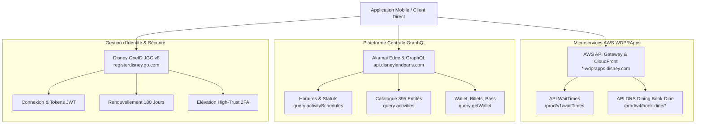

# 🏰 Disneyland Paris - Reverse Engineering & API Documentation (v7.16)

[](https://api.disneylandparis.com)
[](https://reactnative.dev)
[](https://python.org)
[](https://registerdisney.go.com)
[]()

Spécification technique complète, décompilation et intégration directe des APIs officielles de l'application mobile **Disneyland Paris (version 7.16, Build 7507, codename KINNEY, ID `fr.disneylandparis.android`)**.

Ce dépôt documente l'accès direct aux microservices officiels de Disneyland Paris **sans aucun scraper tiers ni passerelle intermédiaire** (pas de ThemeParks.wiki, pas de Queue-Times, pas de serveurs relais).

---

## 📑 Table des Matières
1. [Architecture & Cartographie des APIs](#-architecture--cartographie-des-apis)
2. [Explication Détaillée des Schémas JSON](#-explication-détaillée-des-schémas-json)
   - [1. Fichier de Session (`authenticated_session.json`)](#1-fichier-de-session-authenticated_sessionjson)
   - [2. Réservations de Tables DRS (`slotList`)](#2-réservations-de-tables-drs-slotlist)
   - [3. Horaires & Statuts GraphQL (`activitySchedules`)](#3-horaires--statuts-graphql-activityschedules)
   - [4. Temps d'Attente Directs (`waitTimes`)](#4-temps-dattente-directs-waittimes)
3. [Réservations de Restaurants (DRS Microservice)](#-réservations-de-restaurants-drs-microservice)
4. [Authentification Disney OneID & Fonctionnement Autonome](#-authentification-disney-oneid--fonctionnement-autonome)
5. [Démarrage Rapide (Python)](#-démarrage-rapide-python)
6. [Structure du Dépôt](#-structure-du-dépôt)

---

## 🛰 Architecture & Cartographie des APIs

L'application officielle Disneyland Paris interagit avec deux infrastructures cloud distinctes :



### Endpoints Officiels Clés :
| Service | Protocole | Endpoint | Authentification Requise |
| :--- | :--- | :--- | :--- |
| **Temps d'Attente (WaitTimes)** | REST / JSON | `https://dlp-wt.wdprapps.disney.com/prod/v1/waitTimes` | `x-api-key` statique |
| **Horaires & Catalogue (Schedules)** | GraphQL | `https://api.disneylandparis.com/query` | `x-application-id: mobile-app` |
| **Dates de Restaurant (availableDates)**| REST / JSON | `https://dlp-is-sales-drs-book-dine.wdprapps.disney.com/prod/v4/book-dine/availableDates/{market}` | `x-api-key` + Bearer High-Trust |
| **Créneaux de Table (availabilities)** | REST / JSON | `https://dlp-is-sales-drs-book-dine.wdprapps.disney.com/prod/v4/book-dine/availabilities/{market}` | `x-api-key` + Bearer High-Trust |
| **Disney OneID (Guest Controller)** | REST / JSON | `https://registerdisney.go.com/jgc/v8/client/TPR-DLP.WEB-PROD/*` | Clé client MyDisney |

---

## 📊 Explication Détaillée des Schémas JSON

### 1. Fichier de Session (`authenticated_session.json`)
Ce document conserve l'état d'authentification complet, les jetons cryptographiques et les cookies de session pour les requêtes privées :

```json
{
  "cookies": [
    {
      "name": "SWID",
      "value": "{66C83228-53D6-4189-BB29-0BED7CE9231C}",
      "domain": ".disneylandparis.com",
      "path": "/",
      "expires": 1821055056,
      "httpOnly": false,
      "secure": false
    },
    {
      "name": "TPR-DLP.WEB-PROD.api",
      "value": "4WGlA6dn...",
      "domain": ".disneylandparis.com"
    }
  ],
  "guest": {
    "profile": {
      "swid": "{66C83228-53D6-4189-BB29-0BED7CE9231C}",
      "referenceId": "{66C83228-53D6-4189-BB29-0BED7CE9231C}",
      "email": "visiteur@example.com",
      "firstName": "Jean",
      "lastName": "Dupont",
      "countryCodeDetected": "FR"
    },
    "token": {
      "access_token": "fb643fc81d0e4660a0e0ae39bb81dc91",
      "refresh_token": "729687ba92f8487d95591c2435413ad1",
      "swid": "{66C83228-53D6-4189-BB29-0BED7CE9231C}",
      "ttl": 86400,
      "refresh_ttl": 15552000,
      "high_trust_expires_in": 1799,
      "scope": "AUTHZ_GUEST_SECURED_SESSION",
      "id_token": "eyJraWQiOiJxUEhm..."
    }
  }
}
```

#### Rôle de chaque clé :
* **`cookies`** : Ensemble des cookies de session nécessaires pour franchir les pare-feux Akamai et la salle d'attente (Queue-it).
  * `SWID` (*Software Identifier*) : Identifiant global unique du compte visiteur Disney sous format UUID entre accolades.
  * `TPR-DLP.WEB-PROD.api` : Jeton de session signé utilisé par la passerelle applicative Web/Mobile.
* **`token.access_token`** : Jeton Bearer injecté dans le header `Authorization: Bearer <access_token>` pour les microservices protégés (DRS, portefeuille de billets).
* **`token.refresh_token`** : Jeton de réarmement silencieux longue durée (**180 jours / 6 mois** via `refresh_ttl: 15552000`). Permet de régénérer un `access_token` neuf sans re-saisie du mot de passe.
* **`token.scope`** : Niveau de privilège de la session :
  * `AUTHZ_GUEST_UNSECURED_SESSION` : Session normale (obtenue par rafraîchissement passif). Refusée par le DRS avec code `FORBIDDEN_SCOPE`.
  * `AUTHZ_GUEST_SECURED_SESSION` : Session **High-Trust** (sécurisée par mot de passe récent ou validation OTP 6 chiffres). Indispensable pour interroger et réserver des tables.
* **`token.high_trust_expires_in`** : Compte à rebours en secondes de la session haute confiance (1799s = 30 minutes).

---

### 2. Réservations de Tables DRS (`slotList`)
Renvoyé par `POST /prod/v4/book-dine/availabilities/fr-fr?scope=Restaurant` :

```json
[
  {
    "restaurantId": "P1AR00",
    "date": "2026-10-31",
    "startTime": "11:30:00",
    "endTime": "22:00:00",
    "mealPeriods": [
      {
        "mealPeriod": "LUNCH",
        "slotList": [
          { "time": "12:00 PM", "available": "true" },
          { "time": "12:15 PM", "available": "false" },
          { "time": "12:30 PM", "available": "true" }
        ]
      },
      {
        "mealPeriod": "DINNER",
        "slotList": [
          { "time": "06:30 PM", "available": "true" },
          { "time": "07:00 PM", "available": "false" }
        ]
      }
    ]
  }
]
```

#### Rôle de chaque clé :
* **`restaurantId`** : Identifiant technique du restaurant (ex: `P1AR00` = Captain Jack's, `P2TR02` = Bistrot Chez Rémy, `P1AR06` = Agrabah Café).
* **`startTime` / `endTime`** : Heure d'ouverture et de fermeture du restaurant pour le jour demandé.
* **`mealPeriods`** : Découpage par service (`LUNCH` pour le déjeuner, `DINNER` pour le dîner).
* **`slotList`** : Liste chronologique des créneaux de 15 en 15 minutes.
  * `time` : Heure du créneau (format 12 heures AM/PM).
  * `available` : Chaîne `"true"` si au moins une table pour le `partyMix` (nombre de personnes) est réservable, sinon `"false"`.

---

### 3. Horaires & Statuts GraphQL (`activitySchedules`)
Renvoyé par `POST https://api.disneylandparis.com/query` (sans authentification Bearer) :

```json
{
  "data": {
    "activitySchedules": [
      {
        "id": "P1AR00",
        "name": "Captain Jack's - Restaurant des Pirates",
        "type": "Restaurant",
        "subType": "TableService",
        "schedules": [
          {
            "startTime": "11:30:00",
            "endTime": "22:00:00",
            "date": "2026-10-31",
            "status": "OPERATING",
            "closed": false
          }
        ]
      },
      {
        "id": "P1MR08",
        "name": "Plaza Gardens Restaurant",
        "schedules": [
          {
            "startTime": "00:00:00",
            "endTime": "23:59:00",
            "date": "2026-10-31",
            "status": "REFURBISHMENT",
            "closed": true
          }
        ]
      }
    ]
  }
}
```

#### Statuts officiels :
* `OPERATING` (`closed: false`) : Restaurant ou attraction ouvert au public avec ses plages de service.
* `REFURBISHMENT` (`closed: true`) : Établissement fermé pour réhabilitation / travaux saisonniers.
* `CLOSED` : Établissement fermé ponctuellement.

---

### 4. Temps d'Attente Directs (`waitTimes`)
Renvoyé en direct par `GET https://dlp-wt.wdprapps.disney.com/prod/v1/waitTimes` :

```json
[
  {
    "id": "P1AA01",
    "name": "Big Thunder Mountain",
    "parkId": "P1",
    "status": "OPERATING",
    "postedWaitMinutes": 45,
    "singleRider": {
      "isAvailable": true,
      "waitMinutes": 20
    },
    "standby": {
      "isAvailable": true
    },
    "virtualQueue": {
      "isAvailable": false
    },
    "premierAccess": {
      "isAvailable": true,
      "price": 16.0
    },
    "lastUpdated": "2026-09-15T14:30:00Z"
  }
]
```

---

## 🍽 Réservations de Restaurants (DRS Microservice)

### Règles Métier Officielles Disneyland Paris :
1. **Visiteurs Sans Hôtel Disney (Grand Public)** :
   * Les créneaux ouvrent strictement **60 jours à l'avance** (vers 00h01 CET).
   * Les dates au-delà de 60 jours sont grisées et verrouillées.
2. **Visiteurs avec Séjour en Hôtel Disney** :
   * Accès prioritaire jusqu'à **12 mois à l'avance** dès la confirmation du séjour.
   * La liaison s'effectue automatiquement via le compte MyDisney (`SWID`).
3. **Périodes à Forte Affluence (Halloween, Noël)** :
   * Les restaurants comme *Captain Jack's* affichent complet immédiatement (`⊘` sur le calendrier).
   * L'utilisation d'un scanner de désistement automatisé permet de réserver dès qu'une annulation survient.

---

## 🔐 Authentification Disney OneID & Fonctionnement Autonome

Pour exécuter un bot ou scanner 24/7 en production sans intervention humaine :

### 1. Contexte Persistant (Anti-OTP)
En démarrant Playwright avec un dossier de profil persistant (`launch_persistent_context`), Disney enregistre l'empreinte de confiance du navigateur (`OneID_device`). Une fois l'authentification validée une première fois, les connexions par mot de passe **ne déclenchent plus d'e-mail OTP**.

### 2. Démon de Renouvellement Silencieux (180 Jours)
Un script Python en tâche de fond renouvelle le jeton toutes les 12 heures à l'aide de l'endpoint :
`POST https://registerdisney.go.com/jgc/v8/client/TPR-DLP.WEB-PROD/guest/refresh-auth` avec `{"refreshToken": "..."}`.

### 3. Récupération Automatique de l'OTP par E-mail
En cas de contrôle imprévu de Disney, une règle de redirection e-mail automatique vers une boîte IMAP permet au script de récupérer les 6 chiffres par regex `r'\b\d{6}\b'` et de les injecter en moins de 2 secondes.

---

## 🚀 Démarrage Rapide (Python)

### Interroger les Temps d'Attente en Direct (Sans Compte) :
```python
import httpx

url = "https://dlp-wt.wdprapps.disney.com/prod/v1/waitTimes"
headers = {
    "x-api-key": "3jPT5qMimN3kR2kxqd1ez9iF1C68CrBf7zw5ICo4",
    "User-Agent": "okhttp/4.12.0",
}
res = httpx.get(url, headers=headers)
for ride in res.json()[:5]:
  print(f"{ride['name']} : {ride.get('postedWaitMinutes', 0)} min")
```

### Interroger les Horaires d'un Restaurant (Sans Compte) :
```python
import httpx

query = """
query ($market: String!, $types: [ActivityScheduleStatusInput]!, $date: String!) {
  activitySchedules(market: $market, date: $date, types: $types) {
    id name schedules(date: $date, types: $types) { startTime endTime status closed }
  }
}
"""
payload = {
    "query": query,
    "variables": {
        "market": "fr-fr",
        "types": [{
            "type": "Restaurant",
            "status": ["OPERATING", "REFURBISHMENT", "CLOSED"],
        }],
        "date": "2026-10-31",
    },
}
res = httpx.post(
    "https://api.disneylandparis.com/query",
    json=payload,
    headers={"x-application-id": "mobile-app"},
)
print(res.json()["data"]["activitySchedules"][:3])
```

---

## 📂 Structure du Dépôt

* [**`DISNEYLAND_PARIS_API_SPEC.md`**](file:///c:/Users/elia/Documents/disneyland-paris-app/DISNEYLAND_PARIS_API_SPEC.md) : Spécification technique intégrale de 1000+ lignes détaillant l'architecture Hermes, les 395 entités, les modèles Pydantic et le client Python asynchrone complet.
* [**`app/`**](file:///c:/Users/elia/Documents/disneyland-paris-app/app) : Sources décompilées de l'application Android v7.16 (React Native Hermes bytecode décompilé, TurboModules Kotlin/Java, configuration ProGuard et Manifest).
* [**`assets/`**](file:///c:/Users/elia/Documents/disneyland-paris-app/assets) : Fichiers statiques originaux et configurations de build.

---

## ⚖️ Clause de Non-Responsabilité & Droits
Ce projet est une étude technique et d'ingénierie inversée à visée éducative et d'interopérabilité. Toutes les marques déposées, noms d'attractions, personnages et services mentionnés appartiennent à **The Walt Disney Company** et **Euro Disney Associés S.C.A.**.
